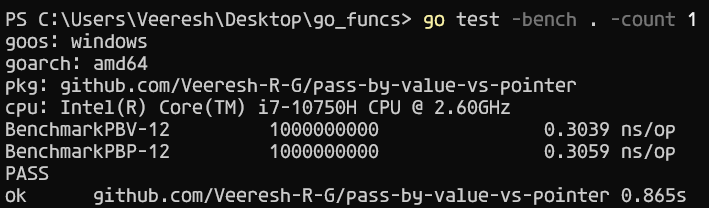
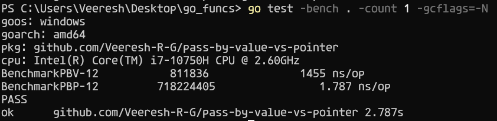
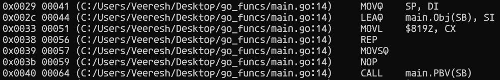

# Pass by Value vs Pass by Pointer

> Everybody tells, passing by pointer is efficient than passing by Value. I got curious, so I wanted to check how efficient is it to pass by Pointer :)

### Benchmark stats with Compiler Optimisation



### Benchmark stats without Compiler Optimisation



> Damn, almost 800x - 840x better performance !!!

- The reason behind this is when we pass by value, a new memory reference is created, which means a new entry in the stack is created and the value of the variable that we pass is _COPIED_ in repeated cycles.

- How do I know this ? I checked the assembly code which is generated when we compile the program. Take a look at this :

```
go tool compile -N -S -l main.go
```



1. The value of the Stack pointer is stored in a destination register
2. The address of the Obj variable is loaded into SI
3. Store 8019 into CX register.
4. REP : stands for repeat certain operations
5. MOVSQ moves the data pointed by the source register (SI) to the destination register (DI). Until CX equals 0. It move words equals to Quadword (64 bits / 8 Bytes)
6. Essentially, for copying the value, we are kinda running a for loop which gets down the efficieny when we try to pass by Value
7. Here comes the interesting part, 8019 \* 8B = 64152B which is the size of the variable that we are trying to copy.
